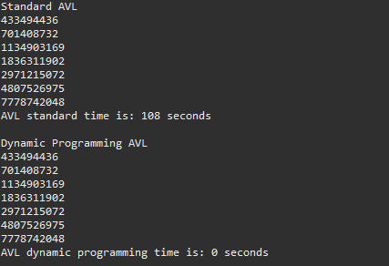

# SoftwareEngineering
###### Software Engineering project Yousup Song, Brandon Stewart, Joel Mathew
> [!WARNING]
> This Software Diagram might be too cool for you
> We will Compute the User Data using the minimum nodes for a given height for an AVL tree function

> [!WARNING]
> This Benchmark might be too cool for you
> The original computation for large number, had a lot of recursive calls, this created a lot of stacks that called a computation that had already been computed before. To optimize the program, we implemented dynamic programming to remember previous computations, so that the function would take a value from an array if it had already seen that computation previously.

